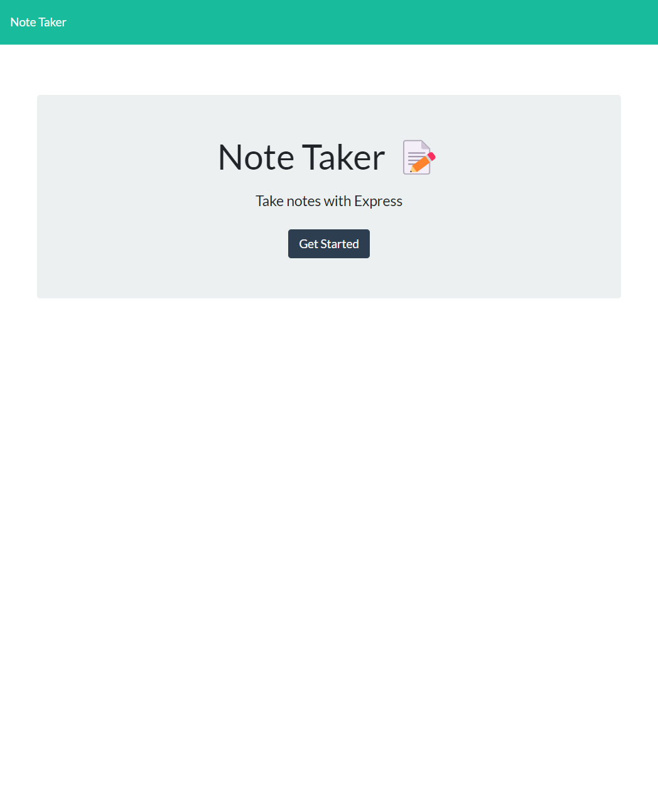

# Note Taker
[](https://github.com/ccffdead/note-taker/issues) [](https://github.com/ccffdead/note-taker/graphs/contributors) ;



## Description
Use this service to take and store notes to help better organize your thoughts and plans.
    
  View the application at [Note Taker](https://ccffdead.github.io/note-taker/).
## Contents
* [License: ](#license:-)
* [Installation: ](#installation:-)
* [Use: ](#use:-)
* [Built With: ](#built-with:-)
* [Contact: ](#contact:-)
* [Test: ](#test:-)
* [Contribution: ](#contribution:-)

## License: 
  This is licensed under GNU license.
  
  ## Installation: 
  To use this project, please install the following:  None
  
  ## Use: 
  View Deployed Page
  
  ## Built With: 
   *HTML *CSS *JavaScript
  
  ## Contact: 
  If you have any further questions, please contact me at ccffdead@gmail.com. You can also find any addtional files at (https://github.com/note-taker/ccffdead). Thanks!
  
  ## Test: 
  To use our applictaion install ``` If issues persist, please log them on the repos' 'Issues' tab. ``` and run `node index.js` from your terminal.
  
  ## Contribution: 
  Enjoy the product!
  
  
